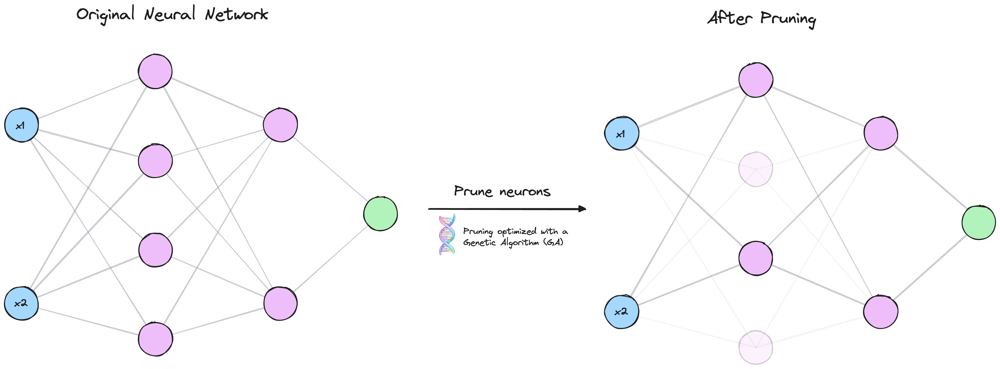

# Genetic algorithms for neural-network pruning



This project studies how the mask representation changes genetic-algorithm pruning of an MLP (`784 → 256 → 256 → 256 → 10`) trained on FashionMNIST.
The final structured approach evolves one bit per hidden neuron and performs much better at high sparsity.

## Present the final report

Requirements are Python 3.13 and [uv](https://docs.astral.sh/uv/).
The report reads the three saved JSON files under `artifacts/results/`; it never reruns training or pruning.

```bash
uv sync --frozen
uv run marimo run notebooks/report.py
```

The live app contains the optional sparsity/method explorer. Create a static, non-reactive backup after copying in the final artifacts:

```bash
uv run marimo export html notebooks/report.py -o report.html --no-include-code -f
```

## Run the experiments

```bash
uv run python main.py train
uv run python main.py structured
uv run python main.py unstructured
uv run python main.py ablation
uv run python main.py multiobjective
```

The `multiobjective` command uses Platypus NSGA-II to maximize validation accuracy and effective structured parameter sparsity simultaneously.
The commands produce `structured.json`, `unstructured.json`, `ablation.json`, and `multiobjective.json`.
Run the offline tests with `uv run pytest -q`. For the cluster workflow, see [docs/ORFEO.md](docs/ORFEO.md); for the complete methodology and fairness rules, see [docs/PROJECT_GUIDE.md](docs/PROJECT_GUIDE.md).

## Repository map

| Path | Purpose |
|---|---|
| `main.py` | training and the three final experiment commands |
| `src/gamo/ga/` | unstructured and structured genetic searches |
| `src/gamo/run/` | canonical experiment protocol and result generation |
| `notebooks/report.py` | artifact-only Marimo presentation |
| `scripts/run_orfeo.sh` | three-job final Slurm submission |
