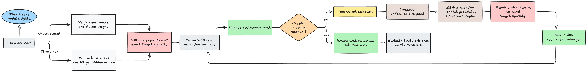

# GAMO: genetic algorithms for neural-network pruning

## What this project studies

GAMO investigates whether a genetic algorithm (GA) can find useful pruning masks for a trained neural network, and in particular how the **representation of a mask** changes the quality of the search.

#### The project compares two representations:

- **Unstructured pruning:** one binary keep/drop gene for every weight. This produces isolated zeros throughout the weight matrices.
- **Structured pruning:** one binary keep/drop gene for every hidden neuron. Dropping a neuron removes its activation and all weight connections that depend on it.

Both searches use the same frozen MLP checkpoint. The GA changes only the binary mask; it does not update or fine-tune the trained weights.

## Complete workflow



The unstructured and structured branches are separate experiments over the same frozen checkpoint and data split.

### 1. Train one canonical MLP

The model is a fully connected ReLU network for FashionMNIST:

```text
784 inputs → 256 → 256 → 256 hidden units → 10 classes
```

FashionMNIST images are converted to tensors and normalized with mean `0.2860` and standard deviation `0.3530`.
Thirty percent of the original training set is reserved for validation using a deterministic split with seed `1337`.
The official FashionMNIST test set remains separate.

#### The single training run uses:

| Setting | Value |
|---|---:|
| Optimizer | AdamW |
| Epochs | 10 |
| Batch size | 128 |
| Initial learning rate | `1e-3` |
| Weight decay | `1e-3` |
| Schedule | cosine annealing to `1e-5` |
| Training seed | 1337 |


Validation loss is measured after every epoch.
The state with the lowest validation loss is saved as the canonical checkpoint.

### 2. Freeze the checkpoint

All model parameters are frozen during pruning. A candidate's fitness is obtained by applying its mask to the retained checkpoint and measuring classification accuracy on the
validation set. There is no pruning-time backpropagation or fine-tuning.

### 3. Choose the mask representation

#### Unstructured weight-level mask

The unstructured chromosome contains one keep/drop bit per **weight parameter**. Biases are excluded from the pruning genome and are always retained. A `1` keeps a weight and a `0` sets it to zero.

#### The structured comparison includes:

- GA with uniform crossover;
- GA with two-point crossover;
- equal-budget random search;
- equal-budget parallel hill climbing;
- random neuron masks;
- global neuron-magnitude pruning; and per-layer neuron-magnitude pruning.

Neuron magnitude is the L2 norm of the incoming weight row.
Global magnitude ranks all hidden neurons together; the per-layer variant allocates the keep budget proportionally and ranks neurons within each layer.

### 4. Enforce an exact sparsity budget

Each search is run independently at target pruning fractions of `30%`, `50%`, `70%`, `85%`, and `90%`. The requested fraction is converted to one shared integer keep count:

```text
keep count = round((1 - sparsity) × genome length)
```

Every candidate within a run has exactly this number of active genes. This matters because
otherwise a mask could obtain better accuracy simply by retaining more parameters or neurons than its competitors. In the GA, crossover and mutation operate on the complete population tensor, so sparsity repair does too:

```python
def repair_population(masks, target_ones):
    if masks.ndim != 2:
        raise ValueError("masks must have shape (population, genes)")
    population, genome_length = masks.shape
    if not 0 <= target_ones <= genome_length:
        raise ValueError("target_ones must be within the genome length")

    # Existing 1s score in [1, 2); existing 0s score in [0, 1).
    # Top-k therefore preserves existing genes whenever possible,
    # while random scores decide which excess 1s or required 0s are selected.
    scores = masks.float() + torch.rand(
        population, genome_length, device=masks.device
    )
    kept = scores.topk(target_ones, dim=1).indices

    repaired = torch.zeros_like(masks, dtype=torch.bool)
    repaired.scatter_(1, kept, True)
    return repaired
```

Each row (candidate) is repaired independently and contains exactly `target_ones` active genes after this operation.

### 5. Initialize and evaluate the population

The GA begins with `100` uniformly sampled fixed-cardinality masks. Fitness is full validation-set accuracy of the frozen masked model.

Evaluation is vectorized across the population. The structured implementation broadcasts each input batch across all neuron masks; the unstructured implementation evaluates a batch of masked parameter tensors.
Validation batches are prepared once and reused to avoid repeated data transfers.

### 6. Create the next generation

If the termination criterion has not been reached, the GA performs:

1. **Tournament selection:** Four candidates are sampled for each tournament and the candidate with the highest validation fitness becomes a parent.
2. **Crossover:** The structured GA is tested with uniform and two-point crossover.
3. **Bit-flip mutation:** Every gene is independently flipped with probability `1 / genome length`, giving one expected flipped bit per offspring before repair.
4. **Sparsity repair:** Crossover and mutation may change the number of active genes, so every offspring is repaired back to the exact keep count.
5. **Elitism:** The strongest feasible mask is copied unchanged into the next population.

The resulting population returns to validation-fitness evaluation.

### 7. Stop after a fixed evaluation budget

The GA stops after `250` evaluated generations. With a population of `100`, this is:

```text
100 masks × 250 generations = 25,000 validation-mask evaluations
```

There is no stagnation-based or target-accuracy early stopping. A fixed budget makes the computational comparison with random search and hill climbing explicit: those methods also receive 25,000 mask evaluations per seed and sparsity level.

### 8. Use the test set once selection is complete

The best mask is selected only by validation accuracy. After the search terminates, that mask is evaluated on the test set to obtain the reported test accuracy.

The stochastic mask searches are repeated with five seeds. Every stochastic method and sparsity level reuses the same repeat streams, `1337–1341`. 
This pairs methods within a sparsity and also pairs a method's runs across the sparsity sweep. 
The checkpoint and data split stay fixed, so variation across these runs measures **mask-search randomness**, not uncertainty across independently trained networks. The sensitivity study uses those same five streams for every variant.

## Experimental interpretation

The experiment conclusions:

1. Under this model and fixed budget, the unstructured GA does not beat the appropriate weight-magnitude baseline.
2. Moving from a weight-level genome to a neuron-level genome makes the genetic search substantially more useful, particularly at high pruning levels.

## Limitations

- The study uses one dataset, architecture, trained checkpoint, and train/validation split.
- Repeated seeds vary mask search only; they do not measure **training-seed variability.**
- Pruned masks are not fine-tuned.
- GA hyperparameters and the 25,000-evaluation budget define a particular computational regime; different budgets or operators could change the comparison.
